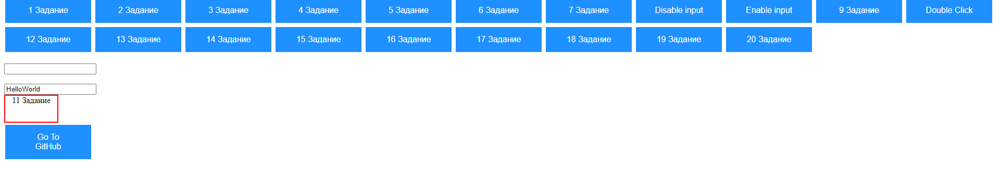
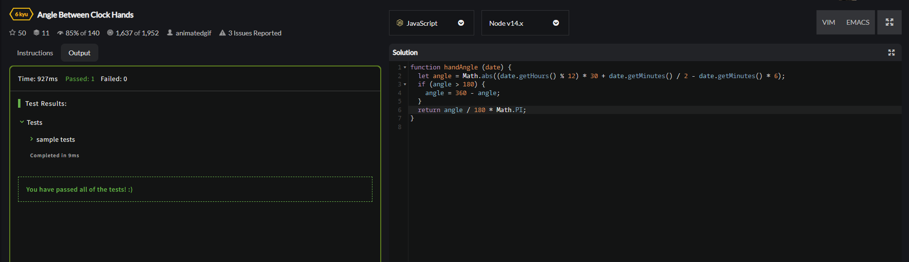
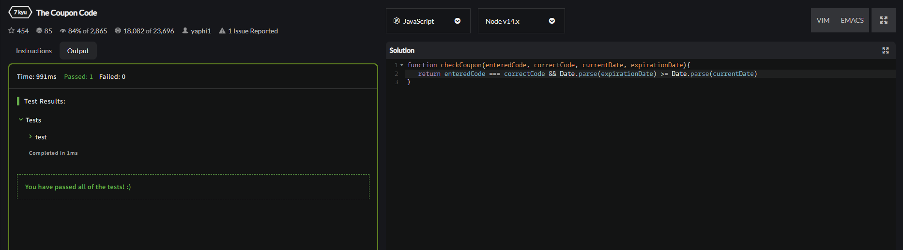
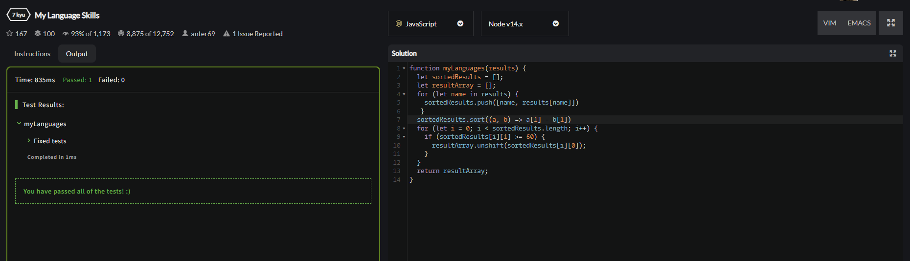
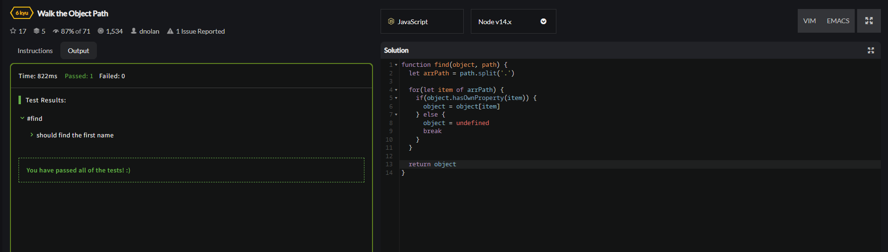
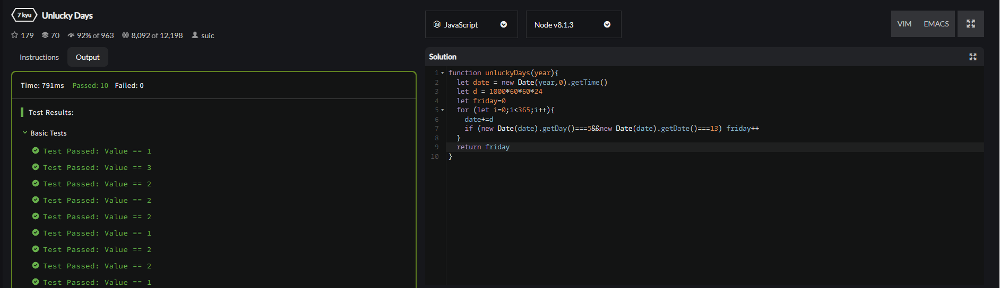

<h2 style="text-align: center; margin-top: 100px;font-size:40px">Лабораторная работа №6</h2>
<h2 style="text-align: center; margin-top:10px">Модель DOM</h2>
<h3 style="text-align: right; margin-top:400px">Выполнил студент 3 курса   Чагочкин Никита</h3>
<h3 style="text-align: center; margin-top:40px">Южно-Сахалинск  2022 г. </h3>

- - -

## Решение:
    let count=0;
    function task1(){
    alert("HelloWorld");
    }

    function task2(){
    let p=document.getElementById("textinput");
    p.value="NewText";
    }

    function task3(){
    let p=document.getElementById("textinput");
    alert(p.value);
    }
    function task4(){
    let p=document.getElementById("textinput2");
    let x=p.value;
    alert(x*x);
    }

    function task5(){
    let p=document.getElementById("textinput2").value;
    document.getElementById("textinput2").value=document.getElementById("textinput").value;
    document.getElementById("textinput").value=p;
    }

    function task6(){
    document.getElementById("butt6").innerText="AnotherText";
    }

    function task7(){
    let p=document.getElementById("textinput2").style.color="red";
    }

    function task8_1(){
    document.getElementById("textinput2").disabled=true;
    }

    function task8(){
    document.getElementById("textinput2").disabled=false;
    }

    function task9(){
    alert("Вы навели мышку на кнопку");
    }

    function task10(){
    alert("Вы нажали на кнопку два раза");
    }

    function task12(){
    let img = document.getElementById("img");
    img.src="cat.jpg";
    }

    function task13(){
    alert("Вы нажали на кнопку");
    }

    function task14(){
    document.getElementById("textinput2").value="HelloWorld";
    }

    function task15(){
    document.getElementById("butt15").disabled=true;
    alert("Кнопка Заблокирована");
    }

    function task16(){
    count++;
    idfirst.innerText=count;
    }

    function task17(){
    document.getElementById("butt17").style.cursor = "crosshair";
    }

    function task18(){
    document.getElementById("hide").style.display="none";
    }

    function task19(){
    document.getElementById("butt19").style.display="none";
    }

    function task20(){
    document.getElementById("calc").style.display="block";
    }

    function plus(){
    let num1=Number(document.getElementById("num1").value);
    let num2=Number(document.getElementById("num2").value);
    idfirst2.innerText=num1+num2;
    }
    function minus(){
    let num1=Number(document.getElementById("num1").value);
    let num2=Number(document.getElementById("num2").value);
    idfirst2.innerText=num1-num2;
    }
    function mult(){
    let num1=Number(document.getElementById("num1").value);
    let num2=Number(document.getElementById("num2").value);
    idfirst2.innerText=num1*num2;
    }
    function div(){
    let num1=Number(document.getElementById("num1").value);
    let num2=Number(document.getElementById("num2").value);
    idfirst2.innerText=num1/num2;
    }
- - -

## Задачи CodeWars:

